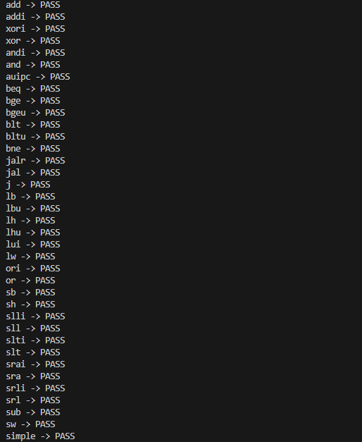
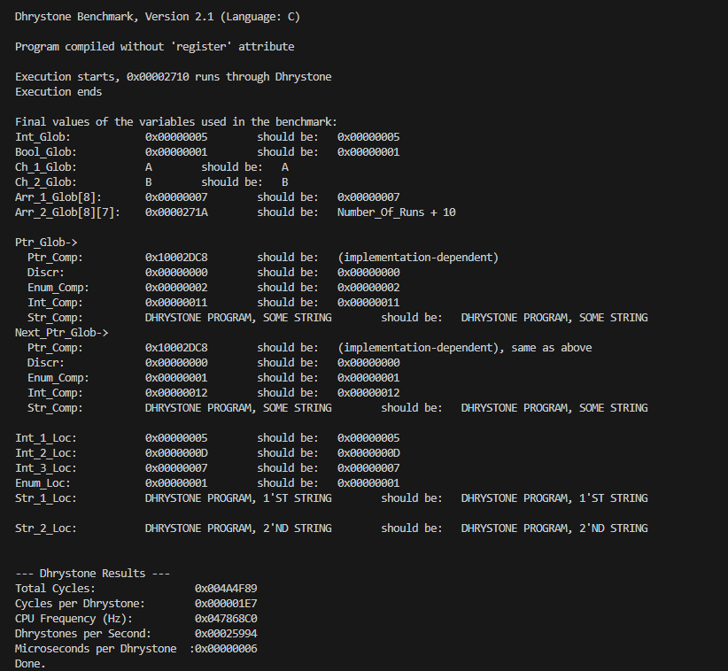
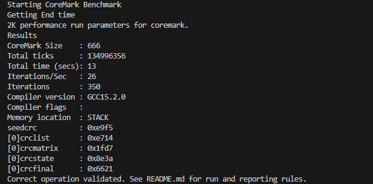

# RISC-V Benchmarking Framework

This repository provides a testing framework for RISC-V based processors. I includes riscv-tests, dhrystone benchmark and coremark benchmark. It also includes a test.c file in folder custom_c_test for writing and testing c based programs.
It was tested on a simplified version of my [RISC-V SoC](https://github.com/TalhaIsrar/RISCV-RV32IM-AXI4-Lite-SoC). The design is evolving as more bugs are being found.

## 📑 Table of Contents

* [Repository Structure](#-repository-structure)
* [Usage](#-usage)
* [Results](#-results)
  * [Riscv-Tests](#-riscv-test)
  * [Dhrystone](#dhrystone)
  * [Coremark](#coremark)
* [How to run](#-how-to-run)
* [Prerequisites](#-prerequisites)
* [Installation](#-installation)
* [Future Work](#-future-work)
* [References](#-references)
* [License](#-license)
* [Contributions](#-contributions)


## 📂 Repository Structure

```
custom_c_test         Write your own C program to test
riscv-tests/          
dhrystone/          
coremark/          
rtl/                  RTL code for RISCV Core
imgs/                 Results
Makefile
test.py               Cocotb test file
LICENSE
README.md             Main documentation#
```

## 📑 Usage
To run any of the tests, after installing the pre-requisties, you can run the following commands:

```bash
make custom
make riscv-tests
make dhrystone
make coremark
```

## 📊 Results

The framework was tested using a simplified RV32I version of my [RISC-V SoC](https://github.com/TalhaIsrar/RISCV-RV32IM-AXI4-Lite-SoC). The results are below:

### RISCV-Test

The image below shows that the core passes all the architectural tests for the RV32I ISA. The files also have support to test RV32IM with a few modifications.



### Dhrystone

The image below shows that the core is working correctly with dhrystone benchmark. The core has a timer support to count the number of cycles the benchmark execution takes. The results reported are hex values and need to be converted to decimal for score calculation.

$$
\text{Total Cycles} = \text{0x0049DA5F} = \text{4840031}
$$
$$
\text{Iterations} = \text{0x2710} = \text{10000}
$$
$$
\text{Clock Frequency} = \text{0x47868C0} = \text{75 MHz}
$$
$$
\text{Cycles per Dhrystone} = \frac{\text{Total Cycles}}{\text{Iterations}} = \text{0x01E7} = \text{484}
$$
$$
\text{Dhrystone per Second} = \frac{\text{Clock Frequency}}{\text{Cycles per Dhrystone}} = \text{0x25DE4} = \text{155108}
$$

These can be used to calculate Dhrystone results:

$$
\text{DMIPS} = \frac{\text{Dhrystone per Second}}{\text{1757}} = \text{88.2}
$$
$$
\text{DMIPS/MHz} = \frac{\text{DMIPS}}{\text{Clock Frequency (in MHz)}} = \text{1.178}
$$



### Coremark

The image below shows that the core is working correctly with coremark benchmark. The core has a timer support to count the number of cycles the benchmark execution takes. The benchmark was run by 10MHz but the core gives upto 185MHz on Ultrascale+ (xczu3eg-sbva484-1-i).

$$
\text{Total Ticks} = \text{134996356}
$$
$$
\text{Clock Frequency} = \text{10 MHz}
$$
$$
\text{Total time (secs)} = \frac{\text{Total Ticks}}{\text{Clock Frequency}} = \text{13.5 (Core is Int so 13)} 
$$
$$
\text{Iterations} = \text{300}
$$
$$
\text{Iterations/Sec} = \frac{\text{Iterations}}{\text{Total time (secs)}}= \text{25.95 (Core is Int so it become 26)}
$$

These can be used to calculate Coremark results:

$$
\text{Coremark/MHz} = \frac{\text{Iterations/Sec}}{\text{Clock Frequency (in MHz)}} = \text{2.59}
$$



## 🔄 How to run
If you want to run the tests on your own core, there are certain things you need to make sure of:
* Your code must have Memory Mapped UART and you need the address (Mine is 0xFFFF0000).
* Your code must have Memory Mapped Timer and you need the address (Mine is 0xFFFFFF00).
* These addresses need to be changed in multiple files where UART and timer are used.
* You understand your memory size and layout. Make sure it is of big enough size and change according to specs in link.ld files.
* Make sure of bit-width of memory, the Makefile assumes both IMEM and DMEM are 32 bits wide but this can be changed to 8 bits as well.
* Make sure you have top module that you connect correctly to cocotb test.py and check module names match.

## 🛠️ Prerequisites

* Linux / WSL
* **RISC-V GNU Toolchain** (`riscv32-unknown-elf-gcc 15.2.0`)
* **Verilator** (`v5.042`)
* **cocotb** (`2.0.1`)
* Gtkwave (optional)

---

## 📦 Installation

### 1️⃣ RISC-V GNU Toolchain (RV32I)

```bash
git clone https://github.com/riscv/riscv-gnu-toolchain
cd riscv-gnu-toolchain
```

```bash
sudo apt-get install -y autoconf automake autotools-dev curl python3 python3-pip \
libmpc-dev libmpfr-dev libgmp-dev gawk build-essential bison flex texinfo gperf \
libtool patchutils bc zlib1g-dev libexpat-dev ninja-build git cmake \
libglib2.0-dev libslirp-dev libncurses-dev
```

```bash
./configure --prefix=$HOME/riscv32i --with-arch=rv32i --with-abi=ilp32
make
```

```bash
echo 'export RISCV=$HOME/riscv32i' >> ~/.bashrc
echo 'export PATH=$RISCV/bin:$PATH' >> ~/.bashrc
source ~/.bashrc
```

```bash
riscv32-unknown-elf-gcc --version
```

---

### 2️⃣ Verilator

```bash
sudo apt-get install -y git help2man perl python3 make autoconf g++ flex bison \
ccache libgoogle-perftools-dev numactl perl-doc \
libfl2 libfl-dev zlib1g zlib1g-dev
```

```bash
git clone https://github.com/verilator/verilator
cd verilator
git checkout stable
autoconf && ./configure && make
sudo make install
```

```bash
verilator --version
```

---

### 3️⃣ cocotb (Python Virtual Environment)

```bash
sudo apt-get install -y python3 python3-pip python3-venv libpython3-dev
```

```bash
python3 -m venv ~/cocotb
source ~/cocotb/bin/activate
pip install cocotb cocotb-bus cocotb-test
```

```bash
python3 -c "import cocotb; print('cocotb OK')"
```

---


## 📌 Future Work

* Adding more benchmarks
* Making it adaptable for more extensions
* Replace hardcoded values with parametric ones

---


## 🔗 References

* [RISCV-Tests](https://github.com/riscv-software-src/riscv-tests/)
* [Coremark](https://github.com/eembc/coremark)
* [Dhrystone](https://github.com/sifive/benchmark-dhrystone)

Huge shoutout to Shashank Sati's work on [Dummy32](https://github.com/satishashank/dummy32)

---

## 📄 License

This project is released under the MIT License. See the [LICENSE](LICENSE) file for details.

---

## 🤝 Contributions

Contributions, suggestions, and issue reports are welcome! Feel free to fork and open pull requests.